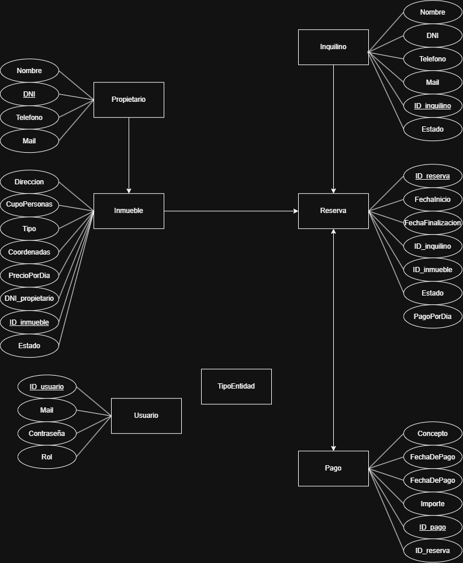
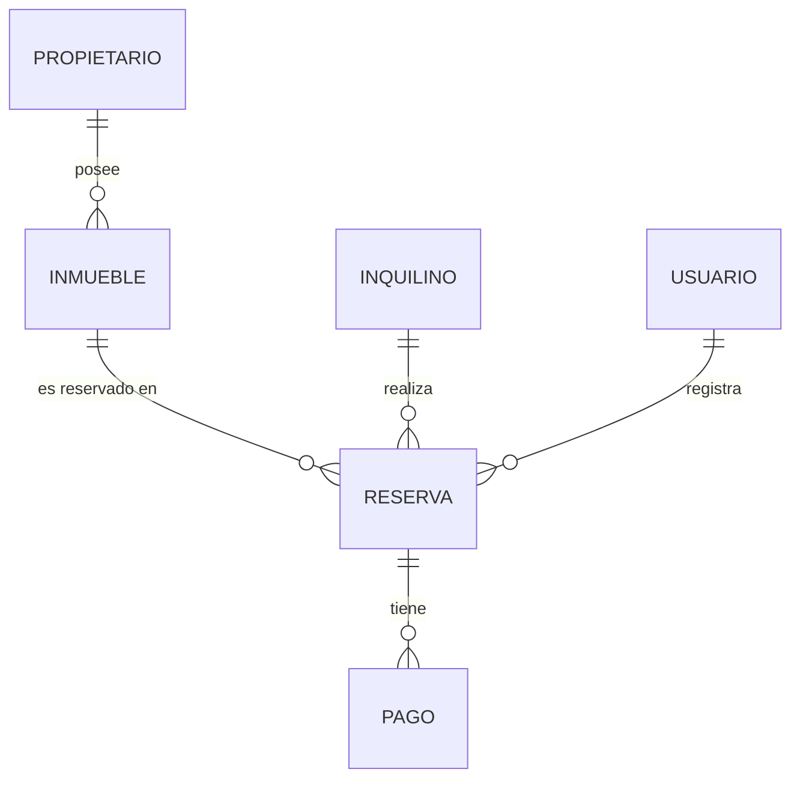

# Reservas Temporales

> Sistema para la gestión de alquileres temporarios de propiedades inmuebles que realiza una agencia inmobiliaria: propietarios, inmuebles, inquilinos, reservas y pagos.

---

## 👥 Integrantes del Grupo

* **Barroso Esteban** - *Estebanbarroso037@gmail.com* - [@esteban1609](https://github.com/esteban1609) - Discord: `venux7076`
* **Josemir Zaleh** - *josemirzaleh45@gmail.com* - [@josemir01](https://github.com/josemir01) - Discord: `pendiente`

---

## 📐 Modelado de Datos

A continuación se presenta el esquema del modelo de datos correspondiente a la aplicación:

### Diagrama Entidad-Relación (DER) / Diagrama de Clases

Ver diagrama en código Mermaid (Opcional)

