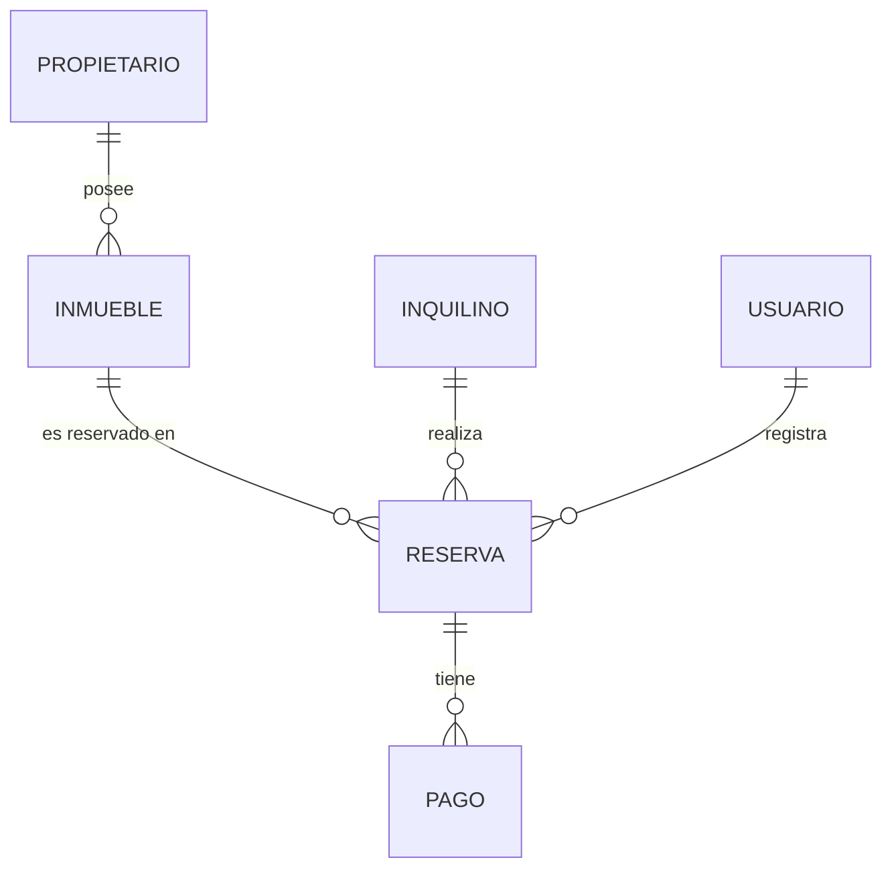

# Reservas Temporales

> Sistema para la gestión de alquileres temporarios de propiedades inmuebles que realiza una agencia inmobiliaria: propietarios, inmuebles, inquilinos, reservas y pagos.

---

## 👥 Integrantes del Grupo

* **Barroso Esteban** - *Estebanbarroso037@gmail.com* - [@esteban1609](https://github.com/esteban1609) - Discord: `venux7076`
* **Josemir Zaleh** - *josemirzaleh45@gmail.com* - [@josemir01](https://github.com/josemir01) - Discord: `Hayman0494`

---

## 📐 Modelado de Datos

A continuación se presenta el esquema del modelo de datos correspondiente a la aplicación:

### Diagrama Entidad-Relación (DER) / Diagrama de Clases

Ver diagrama en código Mermaid (Opcional)

Cómo levantar la Base de Datos

El proyecto usa MySQL. El script inmobiliariaDB.sql crea la base, las tablas y carga datos de prueba.

Opción 1: Desde DBeaver
Conectate a tu servidor MySQL local (Database > New Database Connection > MySQL, usuario/contraseña de tu instalación local).
Abrí un editor SQL nuevo (SQL Editor > New SQL Script).
Abrí el archivo inmobiliariaDB.sql del repositorio (o pegá su contenido) y ejecutalo completo (Ctrl+Enter o el botón ▶ "Execute SQL Script").
Verificá en el árbol de la izquierda que se haya creado la base reservas_temporales con las tablas propietario e inquilino cargadas.
Opción 2: Desde la terminal (cliente mysql)
bash
mysql -u root -p < inmobiliariaDB.sql

Te va a pedir la contraseña de tu usuario de MySQL. El script ya incluye CREATE DATABASE IF NOT EXISTS y USE, así que no hace falta crear la base a mano antes.

Configurar la conexión de la app

Una vez levantada la base, editá appsettings.json (o appsettings.Development.json si lo usás) con tus credenciales reales:

json
{
  "ConnectionStrings": {
    "DefaultConnection": "Server=localhost;Port=3306;Database=reservas_temporales;User=root;Password=TU_PASSWORD;"
  }
}